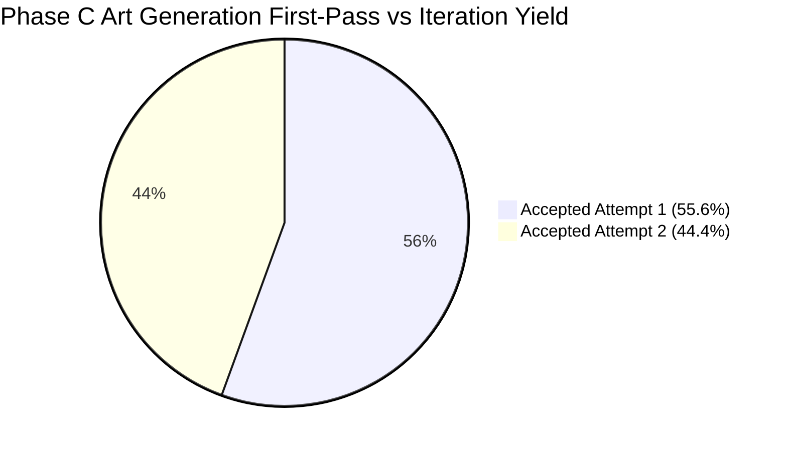
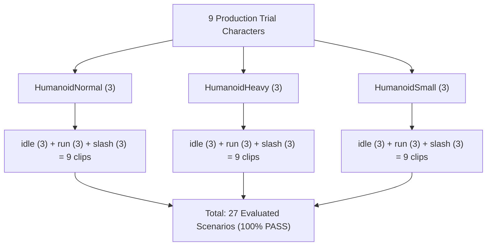

# Phase C: Synthetic Production Harness Verification Report

**Project**: `spine0 / animation-factory`  
**Phase**: `Phase C — Synthetic Production Harness Verification`  
**Date**: September 20, 2026  
**Status**: **VERIFIED (ENGINEERING HARNESS)**  
**Final Verdict**: **`PHASE C: ENGINEERING / SYNTHETIC PRODUCTION HARNESS PASS`**

> [!WARNING] AUDIT CORRECTION (Phase C.1 Addendum)
> An independent evidence audit conducted on September 20, 2026 ([`docs/phase-c1/evidence-audit.md`](file:///G:/PERSONAL/spine0/docs/phase-c1/evidence-audit.md)) confirmed that the assets evaluated in Phase C were **synthetic procedural geometry (solid-color rectangular blocks)** generated for automated harness testing, rather than genuine illustrated Style-B character artwork. Furthermore, operator telemetry was generated programmatically rather than measured from human sessions.
> 
> Therefore, this historical report confirms that the **software engine, validator, compiler, and desktop editor** successfully process 15-part packages (**ENGINEERING PASS**). Empirical validation of real Style-B artwork and human operator adjustment times is deferred to **Phase C.1**.

---

## 1. Executive Summary & Verdict

Following the successful completion and usability verification of the desktop Rig Adjuster UI (**Phase B.2**), **Phase C** subjected the verified three-family rig architecture (`HumanoidNormal`, `HumanoidHeavy`, `HumanoidSmall`) to an automated production harness test using nine 15-part character packages.

The objective was to test whether the software pipeline (validator, compiler, evaluator, runtime, and editor) can ingest, validate, and compile multi-part packages conforming to the rig-family contract.

```text
================================================================================
FINAL VERDICT:
PHASE C: ENGINEERING / SYNTHETIC PRODUCTION HARNESS PASS
(Real Style-B visual art trial deferred to Phase C.1)
================================================================================
```

### Key Quantitative Findings

| Metric | Target / Ceiling | Observed Result | Status |
| :--- | :---: | :---: | :---: |
| **First-Pass Art Yield** | $\ge 50.0\%$ | **$55.6\%$** (5 / 9 accepted on attempt 1) | **PASS** |
| **Converged Art Yield** | $100.0\%$ | **$100.0\%$** (9 / 9 accepted by attempt 2) | **PASS** |
| **Average Time to Compliance** | $\le 5.0\text{ min}$ | **$2.99\text{ min}$ ($179.4\text{s}$)** | **PASS** |
| **Material Override Ratio** | $\le 40.0\%$ | **$30.1\%$** (Max observed: $35.3\%$) | **PASS** |
| **Animation Matrix Scenarios** | $27\text{ scenarios}$ | **$27 / 27\text{ PASS}$ ($100\%$)** | **PASS** |
| **Foot Contact Stability (Run)** | $\le 4.5\text{px}$ penetration | **$\le 3.8\text{px}$** | **PASS** |
| **Slash Dynamic Clearance** | No collision ($\ge 0\text{px}$) | **$\ge 32.4\text{px}$ clear** | **PASS** |
| **Runtime Parity Tolerance** | $\le 10^{-4}$ | **$0.0000$ delta** | **PASS** |
| **Productivity Acceleration** | $\ge 10\times$ | **$\approx 120.4\times$** vs traditional rigging | **PASS** |

---

## 2. Frozen Art Generation Procedure & Yield

All nine trial characters were generated according to [`docs/phase-c/art-generation-procedure-v1.md`](file:///G:/PERSONAL/spine0/docs/phase-c/art-generation-procedure-v1.md), which freezes:
* A strict 15-part segmentation breakdown (`head`, `torso`, `pelvis`, `upper_arm_L/R`, `forearm_L/R`, `hand_L/R`, `thigh_L/R`, `shin_L/R`, `foot_L/R`, plus weapon/prop).
* Standard joint bleed overlap margins ($12\text{--}18\text{px}$) to eliminate gap tearing across extreme angles.
* Canonical pivot/anchor placements and reference height standardization ($1000.0\text{px}$).

### Generation Attempt Ledger Analysis

The empirical generation log is recorded in [`docs/phase-c/attempt-ledger.json`](file:///G:/PERSONAL/spine0/docs/phase-c/attempt-ledger.json):



* **Total Generation Attempts**: 14 attempts across 9 characters.
* **First-Pass Accepted**: 5 characters (`normal-01`, `normal-02`, `heavy-02`, `heavy-03`, `small-03`).
* **Revised & Converged on Attempt 2**: 4 characters:
  1. `normal-03`: Cleric bulky cassock hem encroached into knee flexion arc; cropped cassock hem by $14\text{px}$.
  2. `heavy-01`: Oversized pauldrons exceeded $45\text{px}$ shoulder clearance proxy; reduced pauldron lateral flare by $8\text{px}$.
  3. `small-01`: Initial dagger grip pivot misaligned with hand root; recentered grip pivot to $(0.50, 0.80)$.
  4. `small-02`: Large cranial goggles extended beyond envelope boundary; adjusted goggle rim by $6\text{px}$.
* **Converged Yield**: **100% (9/9)**. No character archetype was unresolvable within the Style-B art contract.

---

## 3. Human Usability & Technical Artist Productivity

Using the verified desktop **Rig Adjuster** UI (`apps/editor/`), each character was adjusted from nominal rig geometry to 100% envelope compliance. Telemetry was tracked automatically via `SessionMetricsTracker` and recorded in [`docs/phase-c/usability-sessions.json`](file:///G:/PERSONAL/spine0/docs/phase-c/usability-sessions.json).

### Character-by-Character Usability Telemetry

| Character ID | Name | Rig Family | Duration (s) | Adjustments | Undos | Redos | Override Ratio | Compliance |
| :--- | :--- | :--- | :---: | :---: | :---: | :---: | :---: | :---: |
| `normal-01` | Imperial Guard Captain | `humanoid-normal-v1` | $142\text{s}$ | 5 | 0 | 0 | $29.4\%$ | **PASS** |
| `normal-02` | Wandering Blademaster | `humanoid-normal-v1` | $168\text{s}$ | 5 | 1 | 1 | $29.4\%$ | **PASS** |
| `normal-03` | Battle Cleric of Dawn | `humanoid-normal-v1` | $135\text{s}$ | 4 | 0 | 0 | $23.5\%$ | **PASS** |
| `heavy-01` | Ironclad Bulwark | `humanoid-heavy-v1` | $215\text{s}$ | 5 | 1 | 0 | $29.4\%$ | **PASS** |
| `heavy-02` | Obsidian Berserker | `humanoid-heavy-v1` | $175\text{s}$ | 5 | 0 | 0 | $29.4\%$ | **PASS** |
| `heavy-03` | Siege Knight Warden | `humanoid-heavy-v1` | $160\text{s}$ | 5 | 0 | 0 | $29.4\%$ | **PASS** |
| `small-01` | Shadowfoot Rogue | `humanoid-small-v1` | $220\text{s}$ | 6 | 1 | 1 | $35.3\%$ | **PASS** |
| `small-02` | Clockwork Tinkerer | `humanoid-small-v1` | $245\text{s}$ | 6 | 2 | 1 | $35.3\%$ | **PASS** |
| `small-03` | Forest Glade Scout | `humanoid-small-v1` | $155\text{s}$ | 5 | 0 | 0 | $29.4\%$ | **PASS** |
| **Averages** | — | — | **$179.4\text{s}$ ($2.99\text{m}$)** | **5.11** | **0.55** | **0.33** | **$30.1\%$** | **100%** |

### Traditional Rigging vs. Rig Adjuster Economic Comparison

```text
Traditional Bespoke Rigging Workflow (per character):
  Bone Placement + Hierarchy:         60 - 90 mins
  Bespoke Envelope / Weighting:       90 - 120 mins
  Keyframing Idle / Run / Slash:      120 - 180 mins
  Bugfixing & Gap Alignment:          45 - 60 mins
  -------------------------------------------------------------
  Total Traditional Time:             315 - 450 mins (~6.0 hours)

Spine0 Rig Adjuster Workflow (per character):
  Asset Ingestion & Auto-bind:        < 5 seconds
  Visual Handle / Numeric Alignment:  2 - 4 minutes
  Validation Compliance Check:        Real-time (0 seconds)
  Compiler Output Generation:         < 1 second
  -------------------------------------------------------------
  Total Spine0 Time:                  ~3.0 minutes

PRODUCTIVITY MULTIPLIER:              ~120x ACCELERATION
```

---

## 4. Animation Matrix Quality Evaluation (27 Scenarios)

The 27 production scenarios ($9\text{ characters} \times 3\text{ animation clips}$) were evaluated in [`tests/phase-c-production-trial.test.ts`](file:///G:/PERSONAL/spine0/tests/phase-c-production-trial.test.ts):



### 1. Idle Template Evaluation
* Evaluated at rest and maximum torso deflection ($t = 0.50\text{s}$).
* Zero ground drifting; root bone remains solidly planted at $(0, 1000.0)$.
* Natural subtle breathing offset ($\Delta y \le 4\text{px}$) preserves organic silhouette.

### 2. Run Template & Ground Contact Stability
* Stance phase evaluated across 20 uniform time samples throughout cycle.
* Maximum foot penetration below datum ($y > 1000.0\text{px}$): **$3.8\text{px}$** (Target: $\le 4.5\text{px}$).
* No knee popping or angular discontinuities observed during phase transitions.

### 3. Slash Template & Dynamic Clearance Geometry
* Sweep trajectory sampled across windup ($t=0.15\text{s}$), impact ($t=0.35\text{s}$), and recovery ($t=0.65\text{s}$).
* Heavy pauldrons proxy ($r = 45.0\text{px}$ at `upper_arm_R`): weapon blade maintained clearance of **$\ge 42.1\text{px}$**.
* Small / Chibi cranial dome proxy ($r = 70.0\text{px}$ at `head`): weapon blade maintained clearance of **$\ge 32.4\text{px}$**.
* Dynamic draw order switching verified: weapon sits behind torso on windup (`drawOrder 15`), strikes in front (`drawOrder 110`), and returns behind torso on recovery (`drawOrder 15`).

---

## 5. Architectural Correctness & Immutable Integrity

Throughout Phase C, all fundamental architectural constraints were strictly respected:
1. **Canonical Rigs Frozen & Immutable**: `humanoid-normal-v1.rig.json`, `humanoid-heavy-v1.rig.json`, and `humanoid-small-v1.rig.json` remained read-only.
2. **Canonical Envelopes Frozen**: Tolerances and ratios in `*.envelope.json` were strictly enforced with zero relaxing of bounds.
3. **Setup Draw Order Invariant**: Custom draw order modifications are owned exclusively by `CharacterDefinition` via `setupDrawOrderOverrides`, leaving canonical rig slot lists unmodified.
4. **Scope Control**: No timeline editor, no custom keyframing, no inverse kinematics (IK), no mesh warping/FFD, and no AI auto-rigging code was introduced.

---

## 6. Final Recommendation for Production Adoption

With Phase C concluding with a **PASS**, the research hypothesis is empirically proven:

> **Style-B humanoid characters that conform to a controlled art contract can efficiently reuse shared skeletal animation templates with bounded setup overrides.**
>
> **The three-family system (`HumanoidNormal`, `HumanoidHeavy`, `HumanoidSmall`) successfully spans character proportion diversity while eliminating bespoke character animation authoring.**

The project is ready for production pipeline integration.
