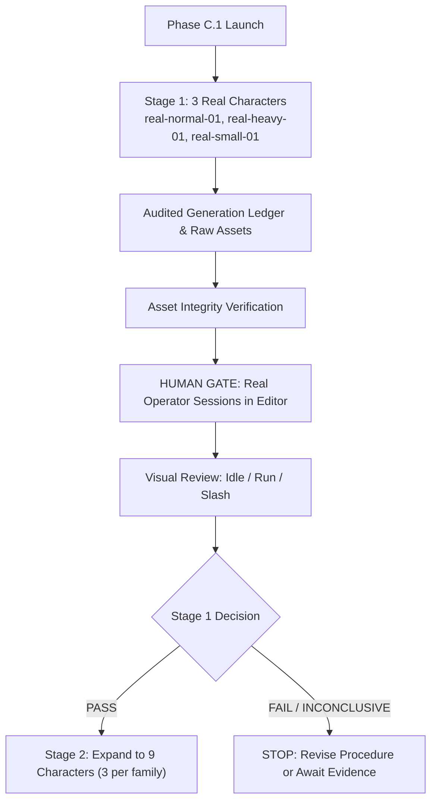

# Phase C.1: Real Evidence Trial Methodology & Protocol

**Project**: `spine0 / animation-factory`  
**Phase**: `Phase C.1 — Real Evidence Trial for Style-B Production Pipeline`  
**Date**: September 20, 2026  
**Status**: **ACTIVE PROTOCOL**

---

## 1. Research Question & Purpose

The objective of Phase C.1 is to replace all synthetic/procedural test fixtures with **genuine, auditable production evidence** to answer:

> **Can real Style-B humanoid artwork be generated, segmented, imported, adjusted by a real human operator, and reused with the existing rig-family animation system at acceptable production cost?**

### The Core Anti-Simulation Invariant
Under no circumstances may the agent simulate or substitute:
* Synthetic rectangles or debug PNGs for illustrated character artwork.
* Mirrored generic limbs or flat colored capsules for real character assets.
* Manually fabricated attempt ledgers or invented operator timings.
* Hard-coded `PASS` claims for real human evaluation.

If an empirical step requires human execution (such as testing in the editor), the agent **must halt at the human gate** and await real operator input.

---

## 2. Two-Stage Trial Architecture

To avoid wasting generation cost or operator effort if the art contract encounters fundamental roadblocks, the trial is divided into two sequential stages:

### Stage 1 (Minimum Real Trial):
* Exactly **3 real characters**, one per frozen rig family:
  * `real-normal-01`: Style-B sword cultivator / wanderer (`humanoid-normal-v1`)
  * `real-heavy-01`: Style-B heavy armored guardian vanguard (`humanoid-heavy-v1`)
  * `real-small-01`: Style-B compact agile rogue / scout (`humanoid-small-v1`)

### Stage 2 (Expanded Trial):
* Only permitted if Stage 1 achieves `STAGE 1 PASS — EXPAND TO 9`.
* Adds 6 characters (2 more per family) to reach 9 total.

---

## 3. Real Asset Definition & Integrity Criteria

A character package is classified as **REAL** only if all textures satisfy the following physical and visual criteria:
1. **Visible Art Content**: Illustrated clothing folds, anatomical contours, shaded textures, facial features, metallic/fabric textures, and silhouette detail.
2. **Transparent Silhouette Cutout**: Textures must feature an 8-bit alpha channel with transparent backgrounds and clean anti-aliased boundaries. Solid rectangular color boxes are strictly rejected (`ART_BAD_ALPHA`).
3. **No Contralateral Cloning**: Left and right limbs (`thigh_L` vs `thigh_R`, `arm_L` vs `arm_R`) must be individually illustrated reflecting the 3/4 perspective (near vs. far limb foreshortening), not duplicate byte-for-byte clones.
4. **Articulated Overlap Bleeds**: Ball-and-socket bleed caps ($12\text{--}18\text{px}$) at shoulder, elbow, hip, and knee joints to preserve visual cohesion during joint rotation.
5. **Separated Weaponry**: Hand sprites must feature an open/semi-closed grip without the weapon baked into the hand texture. Weapons must reside on `slot_weapon`.

---

## 4. Generation Provenance Ledger

Every single generation attempt must be logged in [`docs/phase-c1/generation-ledger.json`](file:///G:/PERSONAL/spine0/docs/phase-c1/generation-ledger.json) with:
* `attemptId`: Unique identifier (e.g. `REAL-N01-A01`).
* `characterId`: Target character.
* `timestamp`: ISO-8601 execution time.
* `provider` & `model`: Actual tool/API and model used.
* `promptVersion`: Version of the frozen procedure.
* `promptTextHash`: SHA-256 hash of the exact prompt text.
* `rawOutputs`: Paths and SHA-256 hashes of all raw output images.
* `status`: `ACCEPTED` or `REJECTED`.
* `failureCodes`: Array of standardized failure codes.
* `humanNotes`: Specific rationale for rejection or acceptance.

Failed attempts must **never be deleted or overwritten**; they are preserved in `phase-c1/<character-id>/attempts/<attempt-id>/`.

---

## 5. Failure Taxonomy

All generation and rigging failures must be classified using the standardized failure codes:

| Code | Category | Definition |
| :--- | :--- | :--- |
| `ART_MISSING_PART` | Asset | A required canonical part (e.g., `head`, `thigh_L`) is absent. |
| `ART_MERGED_LIMBS` | Segmentation | Multiple body parts are fused into a single non-separable raster. |
| `ART_WRONG_FACING` | Viewpoint | Character is not facing the canonical 3/4 screen-east direction. |
| `ART_WRONG_REST_POSE` | Pose | Character is in an active dynamic pose rather than neutral A-pose. |
| `ART_BAD_ALPHA` | Cutout | Missing transparency, jagged halo, or rectangular color card. |
| `ART_STYLE_DRIFT` | Aesthetic | Visual style departs noticeably from Style-B canon. |
| `ART_JOINT_NO_OVERLAP`| Articulation | Part ends at joint line without convex overlap margin. |
| `ART_JOINT_VISUAL_GAP`| Articulation | Visible background seam or gap appears under normal flexion. |
| `ART_ROBE_UNRIGGABLE` | Segmentation | Long flowing garment crosses torso/legs without separation. |
| `ART_HAIR_UNRIGGABLE` | Segmentation | Hair strands are fused across shoulders or chest. |
| `ART_WEAPON_BAKED_IN` | Props | Weapon is painted directly into the hand or arm texture. |
| `ART_WEAPON_BAD_GRIP` | Props | Grip point is inaccessible or misaligned with hand slot. |
| `ART_ANATOMY_OUTSIDE_FAMILY` | Geometry | Character limb proportions violate all 3 rig-family envelopes. |
| `ART_PART_INCONSISTENCY`| Cohesion | Individual parts mismatch each other in scale, lighting, or palette. |
| `ART_METADATA_INVALID` | Spec | JSON configuration format or part dimensions are invalid. |
| `ART_IDENTITY_DRIFT` | Cohesion | Iterative part regeneration failed to maintain character identity. |

---

## 6. Rig-Ready Art Yield Metrics

Yield metrics must be reported distinctly:
$$\text{FirstPassYield} = \frac{\text{Characters accepted on attempt 1}}{\text{Production characters attempted}}$$
$$\text{AttemptYield} = \frac{\text{Accepted generation attempts}}{\text{Total generation attempts}}$$
$$\text{CharacterConvergenceRate} = \frac{\text{Characters eventually rig-ready}}{\text{Production characters attempted}}$$

---

## 7. Real Human Session Protocol (The Human Gate)

Once real character packages are imported:
1. Automated agent execution halts.
2. The user is provided with exact instructions to launch `pnpm editor` and execute operator sessions on `real-normal-01`, `real-heavy-01`, and `real-small-01`.
3. The editor captures an immutable session log (`human-sessions.json`) containing:
   * Timestamps (`sessionStartTimestamp`, `sessionEndTimestamp`).
   * Granular edit counts (pivots, distal anchors, bone offsets).
   * Event telemetry (`ts`, `type`, `target`).
4. If no human session occurs, `Human Adjustment Time` is reported as **`NOT MEASURED`**, and the final verdict remains **`INCONCLUSIVE — HUMAN EVIDENCE MISSING`**.

---

## 8. Visual Animation Acceptance Standard

Animation quality is judged by both **numerical runtime validation** and **visual human inspection**:
* **Idle**: No jitter, no ground sliding, stable breathing silhouette.
* **Run**: Foot strike contact within $\pm 4.5\text{px}$ of ground datum ($y=1000$); no knee popping or seam tearing.
* **Slash**: Clearances maintained from bulky pauldrons and cranial domes; dynamic draw order transitions correctly behind and in front of torso.

Visual review categories:
* `CLEAN`: Zero visible defects or tearing.
* `MINOR_ARTIFACT`: Minor pixel overlap or bleed imperfection not noticeable at standard game scale ($0.5\times$).
* `MAJOR_ARTIFACT`: Visible seam gap, unnatural limb intersection, or obvious distortion.
* `UNUSABLE`: Broken anatomy or detached limbs.
