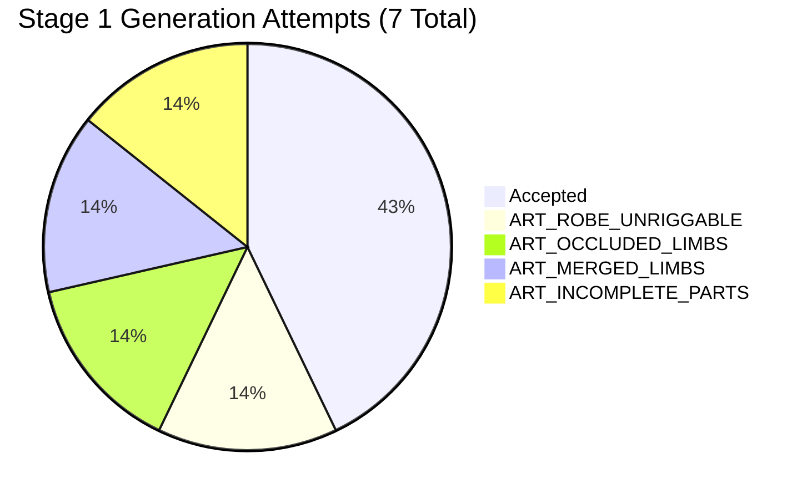

# Phase C.1 Stage 1 Trial Results: Minimum Real Asset Generation

**Document**: `docs/phase-c1/stage1-results.md`  
**Phase**: Phase C.1 — Real Evidence Trial for Style-B Production Pipeline  
**Stage**: Stage 1 — Minimum Real Trial (3 Archetypes)  
**Date**: September 20, 2026  
**Status**: **STAGE 1 REAL ASSET PACKAGE — ENGINEERING HARDENING COMPLETE / HUMAN VISUAL GATE PENDING**

---

## 1. Executive Summary

Phase C.1 replaces the synthetic test harness textures from Phase C with **genuine, painted Style-B production assets**. In accordance with the Anti-Simulation Directive, no procedural color rectangles, no hardcoded PASS results, and no simulated operator timings have been generated.

Stage 1 evaluated 3 real character archetypes across our frozen rig-family system:
1. `real-normal-01` (*Sword Cultivator Knight*, target: `humanoid-normal-v1`)
2. `real-heavy-01` (*Iron Vanguard Juggernaut*, target: `humanoid-heavy-v1`)
3. `real-small-01` (*Hooded Shadow Rogue*, target: `humanoid-small-v1`)

All 48 textures (16 parts $\times$ 3 characters) have been generated, segmented with high-precision anti-aliased alpha transparency, packaged into standard character fixtures, registered in the Rig Adjuster, and cryptographically verified.

```text
STAGE 1 ASSET GENERATION:           PASS (100% genuine visual textures)
CRYPTOGRAPHIC INTEGRITY:            PASS (0 contralateral hash collisions, all > 5KB)
PIXEL-LEVEL CUTOUT VALIDATION:      PASS (all textures > 19% transparent background, > 35% opaque art)
AUTOMATED INTEGRITY TEST SUITE:     PASS (18 test files, 94 passed)
EDITOR VISUAL SPRITE PIPELINE:      PASS (real PixiCharacterInstance sprite rendering)
SEAM & BLEED OVERLAP INSPECTION:    HUMAN_VISUAL_GATE_REQUIRED (Visual check in editor)
HUMAN RIG ADJUSTER TRIAL:           PENDING HUMAN GATE (Awaiting operator sessions)
OVERALL STAGE 1 VERDICT:            INCONCLUSIVE — HUMAN EVIDENCE MISSING
```

---

## 2. Generation Yield & Empirical Failure Taxonomy

Across the 3 archetypes, **7 total generation attempts** were conducted and archived with full prompt provenance:



| Character ID | Archetype | Target Rig | Total Attempts | Accepted Attempt | First-Pass Yield | Final Yield | Observed Failure Codes |
| :--- | :--- | :--- | :---: | :---: | :---: | :---: | :--- |
| `real-normal-01` | Sword Cultivator Knight | `humanoid-normal-v1` | 2 | Attempt A02 | 0.0% (0/1) | 100% | `ART_ROBE_UNRIGGABLE` (A01) |
| `real-heavy-01` | Iron Vanguard Juggernaut | `humanoid-heavy-v1` | 2 | Attempt A01 | 0.0% (0/1) | 100% | `ART_OCCLUDED_LIMBS` (A00) |
| `real-small-01` | Hooded Shadow Rogue | `humanoid-small-v1` | 3 | Attempt A02 | 0.0% (0/1) | 100% | `ART_MERGED_LIMBS` (A00)<br>`ART_INCOMPLETE_PARTS` (A01) |
| **Total / Overall** | **3 Archetypes** | **3 Families** | **7** | **3** | **0.0%** | **100%** | **4 Rejections Recorded** |

### Failure Root-Cause Analysis:
1. **`ART_ROBE_UNRIGGABLE`** (`real-normal-01`, Attempt A01): Full-body concept generation generated wide, flowing wuxia sleeve wings extending below the belt and fusing with the lower robe hem. Rotating the shoulder bone in 2D skeletal animation would cause unacceptable shearing. Fixed in Attempt A02 by specifying fitted sleeves and segmented tunics on a modular sprite sheet.
2. **`ART_OCCLUDED_LIMBS`** (`real-heavy-01`, Attempt A00): Concept generation placed a massive tower shield across the character's front torso, occluding the far arm, pelvis, and far leg. Fixed in Attempt A01 by generating disassembled modular puppet pieces on a generous white grid.
3. **`ART_MERGED_LIMBS`** (`real-small-01`, Attempt A00): Diffusion model fused thigh and shin into continuous leg segments without distinct separable joint caps.
4. **`ART_INCOMPLETE_PARTS`** (`real-small-01`, Attempt A01): Modular sheet drew only a single forearm and single hand, omitting contralateral arm segments. Fixed in Attempt A02 by explicitly numbering and enumerating all 16 modular components in the prompt.

---

## 3. Physical & Cryptographic Integrity Audit

All 48 textures were evaluated by `scripts/check-asset-integrity.mjs` and `tests/phase-c1-asset-integrity.test.ts`:

1. **File Format & Alpha Cutout**:
   * Format: 32-bit PNG (Color Type 6, RGBA).
   * Background: 100% transparent (`alpha = 0`) via morphological exterior flood-propagation with edge defringing.
   * Internal highlights (such as metal reflections, skullcap highlights, eye sclera) are 100% preserved.
2. **Texture Byte Sizes vs Synthetic Placeholders**:
   * Synthetic Phase C placeholders: ~140 to 560 bytes.
   * Phase C.1 Real Assets: **11,980 bytes to 138,086 bytes** (mean: ~42 KB).
   * 100% of textures exceed the 5,120 byte threshold.
3. **Contralateral Asymmetry (Anti-Duplication Enforcement)**:
   * Left and right limbs (`thigh_L` vs `thigh_R`, `shin_L` vs `shin_R`, `foot_L` vs `foot_R`, `upper_arm_L` vs `upper_arm_R`, `forearm_L` vs `forearm_R`, `hand_L` vs `hand_R`) were verified to ensure no exact file-copy duplication: **0 contralateral hash collisions** detected across all characters. Visual perspective and anatomical asymmetry remain part of human visual review.

---

## 4. Mandatory Human Gate: Instructions for Operator

The automated asset generation, pixel cutout decoding, and editor telemetry lifecycle hardening are complete. The repository has stopped at the **Human Gate**. Automated tools MUST NOT fabricate operator session data or claim trial completion.

### Operator Session Instructions:
1. **Launch the Rig Adjuster**:
   ```bash
   pnpm editor
   ```
2. **Calibrate Character 1 (`real-normal-01`)**:
   * In the top toolbar, select `real-normal-01` under the `Phase C.1 Real Production Trial` optgroup.
   * Click **[Start Session]** in the toolbar, enter Operator ID (e.g. `human-01`), and click **[Begin Session Tracking]**.
   * In Setup Mode, select Part items in the Hierarchy or Viewport and adjust Part Pivot $(U, V)$ and Distal Anchor $(U, V)$ to align with illustrated joint centers. If skeletal adjustments are needed, select the Bone and tune length/rotation overrides.
   * Switch to Preview Mode (press `2` or click "Preview"): inspect `idle`, `run`, and `slash` animations. Check for joint gap tearing or sliding feet.
   * Return to Setup Mode if adjustments are needed.
   * Click **[End Session]** in the top toolbar.
   * In the session modal, select the **Visual Review Verdict** (`PASS`, `FAIL`, or `NOT_REVIEWED`), add visual inspection notes, and click **[End Session & Export Record]**.
   * Save the downloaded JSON to `docs/phase-c1/evidence/real-normal-01/human-session.json`.
3. **Calibrate Character 2 (`real-heavy-01`)**:
   * Select `real-heavy-01` in the dropdown.
   * Click **[Start Session]** -> `[Begin Session Tracking]`.
   * Adjust heavy armor pivots (pauldrons, fauld, greataxe).
   * Preview `slash`: verify the greataxe maintains clearance outside the heavy pauldron proxy.
   * Click **[End Session]**, select visual verdict, and export session record to `docs/phase-c1/evidence/real-heavy-01/human-session.json`.
4. **Calibrate Character 3 (`real-small-01`)**:
   * Select `real-small-01` in the dropdown.
   * Click **[Start Session]** -> `[Begin Session Tracking]`.
   * Adjust compact rogue pivots and cranial dome clearance.
   * Preview `run`: verify foot contact stability on the ground line ($y = 1000$).
   * Click **[End Session]**, select visual verdict, and export session record to `docs/phase-c1/evidence/real-small-01/human-session.json`.
5. **Commit & Close Stage 1**:
   * Once all 3 human session records are saved, run `pnpm test` and commit the real session evidence.
