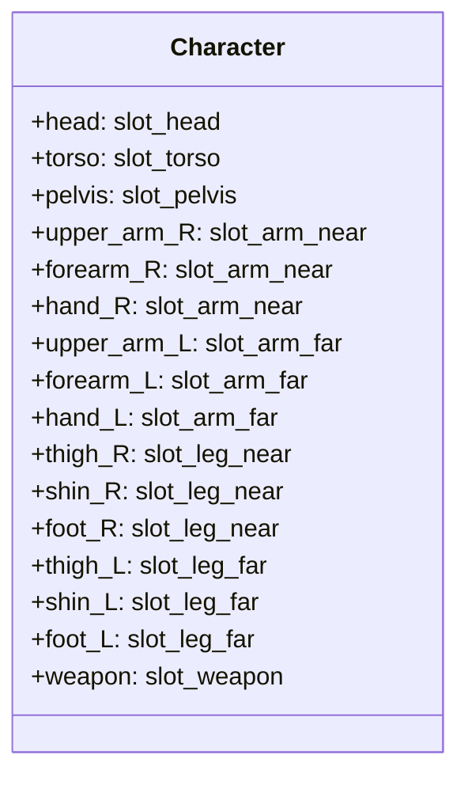

# Style-B Real Art Generation Procedure (v1.0)

**Document**: `docs/phase-c1/style-b-real-generation-procedure-v1.md`  
**Version**: `1.0.0-phase-c1`  
**Date**: September 20, 2026  
**Status**: **FROZEN PRODUCTION PROCEDURE**

---

## 1. Visual Canon Specification

The Style-B art contract governs 2D illustrated character sprites designed for high-resolution skeletal animation.

### 1.1 Aesthetic Style & Shading
* **Genre / Look**: Xianxia / Wuxia / Anime-semi-realistic fantasy.
* **Rendering**: Hand-painted digital illustration with defined forms, clean contour linework, and soft volumetric shading.
* **Lighting Key**: Consistent directional key light from top-left ($45^\circ$), with subtle ambient occlusion at concavities and creases.
* **Silhouette Integrity**: Distinct, recognizable character silhouettes without visual clutter that obscures joint articulation.

### 1.2 Canonical Perspective & Facing
* **Viewpoint**: $3/4$ perspective facing camera-right (screen-east, approximately $+30^\circ$ yaw).
* **Rest Pose (A-Pose)**:
  * Torso perfectly vertical ($0^\circ$ pitch and roll).
  * Near arm (`upper_arm_R`): Abducted $-15^\circ$ from torso, forearm slightly bent forward.
  * Far arm (`upper_arm_L`): Abducted $+15^\circ$ from torso, slightly foreshortened by depth.
  * Hands: Open relaxed fist or curved grip ready to receive weapon handle.
  * Legs: Parallel stance, knees unbent, feet resting flat on ground datum plane ($y = 1000.0\text{px}$).
* **Reference Height**: Standardized to $1000.0\text{px}$ measured from top of head to ground plane.

---

## 2. Part Segmentation & Layer Breakdown (15 Parts + Weapon)

Every Style-B character package must be decomposed into at least 15 separable body parts and an optional detached weapon:

| Part Key | Target Slot | Description & Art Contract Boundaries |
| :--- | :--- | :--- |
| `head` | `slot_head` | Face, ears, base skullcap hair, horns/helm. Flowing hair tails or braids must be detached or kept behind shoulder planes. |
| `torso` | `slot_torso` | Chest armor, tunic, collar to belt line. Lower edge terminates at waist. |
| `pelvis` | `slot_pelvis` | Belt, hip armor, groin sash, upper breech. Robes/skirts must terminate above knees or be assigned to apron slots. |
| `upper_arm_R` | `slot_arm_near` | Near shoulder to elbow. Proximal cap has a rounded convex bleed ($15\text{px}$) to tuck smoothly into torso. |
| `forearm_R` | `slot_arm_near` | Near elbow to wrist. Proximal cap has a rounded convex bleed ($12\text{px}$) tucking into upper arm. |
| `hand_R` | `slot_arm_near` | Near hand. Open or semi-closed grip. **Weapon MUST NOT be baked into hand sprite.** |
| `upper_arm_L` | `slot_arm_far` | Far shoulder to elbow. Slightly foreshortened for 3/4 perspective. |
| `forearm_L` | `slot_arm_far` | Far elbow to wrist. |
| `hand_L` | `slot_arm_far` | Far hand. |
| `thigh_R` | `slot_leg_near` | Near hip to knee. Proximal cap has a rounded convex bleed ($15\text{px}$) tucking under pelvis armor. |
| `shin_R` | `slot_leg_near` | Near knee to ankle. Proximal cap has a rounded convex bleed ($15\text{px}$) tucking under thigh. |
| `foot_R` | `slot_leg_near` | Near boot/shoe resting flat on ground line. |
| `thigh_L` | `slot_leg_far` | Far hip to knee. Foreshortened and partially occluded by pelvis/near leg. |
| `shin_L` | `slot_leg_far` | Far knee to ankle. |
| `foot_L` | `slot_leg_far` | Far boot/shoe. |
| `weapon` | `slot_weapon` | Detached weapon (sword, mace, dagger, staff) isolated with transparent background. Grip point centered. |

---

## 3. Alpha, Cutout, and Joint Articulation Rules

1. **Alpha Channel**:
   * PNG format: 32-bit RGBA (8 bits per channel).
   * Background must be 100% transparent (`alpha = 0`).
   * Clean anti-aliased edge masking; no jagged halos, white fringes, or color matting.
   * Solid rectangular cards without alpha cutouts are strictly forbidden (`ART_BAD_ALPHA`).
2. **Joint Overlap Bleeds**:
   * All rotational joints (shoulder, elbow, hip, knee) must possess a rounded convex cap of $12\text{--}18\text{px}$ extension beyond the nominal joint pivot.
   * Flat-cut or concave joint terminations that expose gaps during rotation are forbidden (`ART_JOINT_NO_OVERLAP`).
3. **Costume & Robe Splitting**:
   * Robes, tabards, and sashes must not cross articulation boundaries (e.g. a robe extending continuously from neck to ankle is forbidden; it must be split into torso, pelvis, and apron segments).
4. **No Contralateral Cloning**:
   * Left and right limbs must be drawn independently to reflect depth, perspective foreshortening, and shadow grading (`thigh_L` $\ne$ `thigh_R`). Identical files are flagged as synthetic duplication.

---

## 4. Pivot and Distal-Anchor Geometric Conventions

Standard normalized local coordinates $(u, v) \in [0.0, 1.0]$:
* $(0, 0)$ is top-left of part bounding box.
* $(1, 1)$ is bottom-right of part bounding box.

| Part | Pivot $(u, v)$ | Distal Anchor $(u, v)$ | Description |
| :--- | :---: | :---: | :--- |
| `head` | $(0.50, 0.85)$ | $(0.50, 0.15)$ | Pivot at neck joint, anchor at cranial apex. |
| `torso` | $(0.50, 0.90)$ | $(0.50, 0.10)$ | Pivot at lower spine/waist, anchor at neck base. |
| `pelvis` | $(0.50, 0.50)$ | — | Pivot centered at root pelvis joint. |
| `upper_arm_R/L` | $(0.50, 0.15)$ | $(0.50, 0.85)$ | Pivot at shoulder glenohumeral joint, anchor at elbow joint. |
| `forearm_R/L` | $(0.50, 0.15)$ | $(0.50, 0.85)$ | Pivot at elbow joint, anchor at wrist joint. |
| `hand_R/L` | $(0.50, 0.20)$ | $(0.50, 0.80)$ | Pivot at wrist joint, anchor at grip center. |
| `thigh_R/L` | $(0.50, 0.15)$ | $(0.50, 0.85)$ | Pivot at hip joint, anchor at knee joint. |
| `shin_R/L` | $(0.50, 0.15)$ | $(0.50, 0.85)$ | Pivot at knee joint, anchor at ankle joint. |
| `foot_R/L` | $(0.30, 0.35)$ | $(0.85, 0.85)$ | Pivot at ankle, anchor at toe contact point. |
| `weapon` | $(0.50, 0.85)$ | $(0.50, 0.10)$ | Pivot at hilt grip point, anchor at blade tip. |

---

## 5. Frozen Production Protocol Rule

Once Stage 1 starts, this generation procedure document is cryptographically frozen via SHA-256 in [`docs/phase-c1/style-b-real-generation-freeze.json`](file:///G:/PERSONAL/spine0/docs/phase-c1/style-b-real-generation-freeze.json). Any subsequent modification to art rules, dimensions, or anchors invalidates the production batch and requires full re-evaluation.
